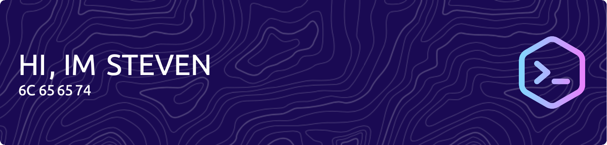

Welcome to my GitHub! I'm Steven, a Security Engineer with a focus on Incident Response.

### ✔️ I'm currently learning
- Terraform
- Python
- AWS
- CICD Pipelines

### 😍 What I like to do:
- Spending time with family
- Staying physically active
- Steamdeck Enthusiast
- LEGO
- Reading (mainly fantasy)

### 💡 Goals for 2023:
- Start a project which aligns with my goals and adds to my skillset
- Publish blog post on Phase 1 of the project

### 🛠 Interested in:
- Security, Cloud, Scripting, Games